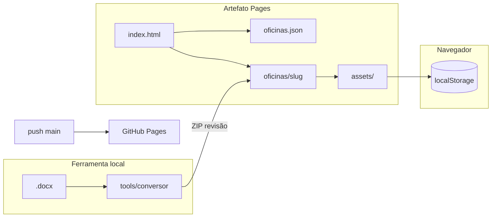

# SDD — Estado técnico real

Documento norte técnico. Reflete o que o código faz **hoje** (baseline jul/2026). Atualizar quando arquitetura, fluxos ou regras mudarem.

## 1. Visão técnica em uma linha

Portal estático de roteiros pedagógicos: HTML + CSS/JS compartilhados + Tailwind CDN; uma oficina publicada; conversor DOCX local parcial; deploy GitHub Pages; progresso só no `localStorage`.

## 2. Arquitetura

### Componentes

| Peça | Papel |
|------|--------|
| `index.html` | Home / catálogo |
| `oficinas.json` | Metadados das oficinas (espelho embutido em `#oficinas-data`) |
| `oficinas/{slug}/` | HTML da oficina + `images/` (+ opcional `fonte/*.docx`) |
| `assets/css/nave.css` | Design system, painéis, home, lightbox |
| `assets/js/nave.js` | Runtime: painéis, progresso, accordions, persistência |
| `assets/js/tailwind-config.js` | Tokens de cor/espaçamento |
| `tools/conversor/` | Upload DOCX → parse → HTML/ZIP/prévia (uso local) |
| `.github/workflows/pages.yml` | Deploy: checkout → Pages (path: `.`, sem build) |

Diagrama — visão estática + cliente

### Stack real

- HTML5, Tailwind CSS via CDN, Lexend + Material Symbols
- JavaScript vanilla (IIFE em `nave.js`)
- Conversor: JSZip via CDN no browser
- Sem framework SPA, sem bundler obrigatório, sem backend, sem SQL

## 3. Fluxos que existem

**A — Consumir oficina:** educador abre o catálogo → card → página da oficina → modo painel (hash `#view` … `#beyond`) → percorre “Para ir além” como última etapa quando ela existe → Concluir grava conclusão → home mostra badge.

**B — Publicar manualmente:** pasta `oficinas/{slug}/` + entrada em `oficinas.json` → push `main`.

**C — Conversor (local):** `.docx` → `tools/conversor/` → prévia/`localStorage` ou ZIP → revisão → fluxo B.

## 4. Modelo de dados

Não há banco. Persistência e conteúdo:

| Camada | Chave / arquivo | Conteúdo |
|--------|-----------------|----------|
| Cliente | `nave-section:{pathname}` | Última seção visitada |
| Cliente | `nave-checkboxes:{pathname}` | JSON de checkboxes |
| Cliente | `nave-completed:{slug}` | ISO datetime ao Concluir |
| Cliente | `nave-preview-html` / `nave-preview-ts` | Prévia do conversor |
| Estático | `oficinas.json` | id, título, arquivo, ícone, ano, duração… |
| Estático | HTML da oficina | Seções `view\|materials\|prepare\|create\|reflect\|beyond` |

Progresso na home: 0% se só Visão/sem seção; seções intermediárias avançam progressivamente; Refletir = 90%; “Para ir além” sem Concluir = 90% com pendência de conclusão; após Concluir = 100%.

## 5. Regras inquebráveis

1. **Estático em produção** — sem API de aplicação, sem login, sem CMS na v1 vigente.
2. **Sem SQL** — estado de uso só no browser (`localStorage`).
3. **Conteúdo pedagógico prevalece** — conversor acelera; revisão humana é esperada.
4. **Oficina publicada** tem `index.html`, `images/` se houver mídia, e entrada em `oficinas.json`.
5. **Seções obrigatórias:** Visão geral, Materiais, Preparar, Criar, Refletir. **Para ir além** mantém indicação pedagógica de opcional, mas, quando existir, participa da navegação sequencial como última etapa antes de Concluir.
6. **Assets compartilhados** em `assets/`; páginas de oficina usam `../../assets/`.
7. **Deploy** = conteúdo do repositório na raiz via GitHub Actions → Pages.
8. **Documentação D.N.E.E.** — mudanças relevantes atualizam SDD / ROADMAP / Evidências; evidências no formato `## AAAA-MM-DD · HH:MM — [Nome]`.

## 6. Runtime (`nave.js`) — ordem de boot

`initSectionPanel` → `initInSectionAnchors` → `initExternalLinks` → `initImageLightbox` → `initSectionRestore` → `initBackToTop` → `initCheckboxPersist` → `initHomeOficinas` → `initMetaHints` → `initWorkshopAccordions` → `initDicasAccordions`

Painéis ocultam seções com `.nave-panel-hidden` + `aria-hidden`. Accordions de oficina: um aberto por grupo e scroll ao trigger.

## 7. Fora de escopo (estado atual)

- Contas de usuário / sync em nuvem do progresso
- Build pipeline obrigatório (Vite/Webpack) para o site
- Conversão 100% automática sem revisão
- App nativo mobile
- Banco de dados servidor

## 8. Riscos conhecidos (código)

- Mídia GIF ~187 MB na oficina referência
- Conversor ainda diverge do golden master
- Metadados duplicados JSON ⇄ embed ⇄ HTML
- Artefato Pages inclui docs/tools
- Dependência de CDN (Tailwind/fontes)

Detalhamento e checkboxes: `docs/ROADMAP.md`.

## 9. Histórico deste SDD

| Data | Mudança |
|------|---------|
| 2026-07-17 | “Para ir além” passa a ser a última etapa da navegação antes da conclusão |
| 2026-07-15 | Reescrita no padrão D.N.E.E. a partir do Raio-X do código |
| 2026-07-13 | Modo painel documentado (versão anterior) |
| 2026-06-23 | SDD inicial |
